# 第一次有人把5G讲的这么简单明了

关于5G通信，常见的文章都讲的晦涩难懂，不忍往下看，特转载一篇，用大白话实现5G入门。

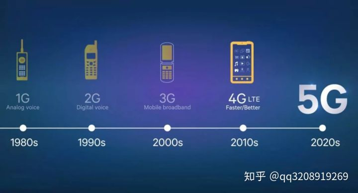

简单说，5G就是第五代通信技术，主要特点是波长为毫米级，超宽带，超高速度，超低延时。1G实现了模拟语音通信，大哥大没有屏幕只能打电话；2G实现了语音通信数字化，功能机有了小屏幕可以发短信了；3G实现了语音以外图片等的多媒体通信，屏幕变大可以看图片了；4G实现了局域高速上网，大屏智能机可以看短视频了，但在城市信号好，老家信号差。1G~4G都是着眼于人与人之间更方便快捷的通信，而5G将实现随时、随地、万物互联，让人类敢于期待与地球上的万物通过直播的方式无时差同步参与其中。

----------------------------------------------------------

## 一个简单且神奇的公式

今天的故事，从一个公式开始讲起。

这是一个既简单又神奇的公式。说它简单，是因为它一共只有3个字母。而说它神奇，是因为这个公式蕴含了博大精深的通信技术奥秘，这个星球上有无数的人都在为之魂牵梦绕。

这个公式，就是它——

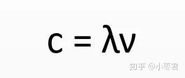

我相信很多同学都认出这个公式了，如果没认出来，而且你又是一个理科生的话，请记得有空多给你的中学物理老师打打电话！

小枣君解释一下，上面这个公式，这是物理学的基本公式，光速=波长×频率。

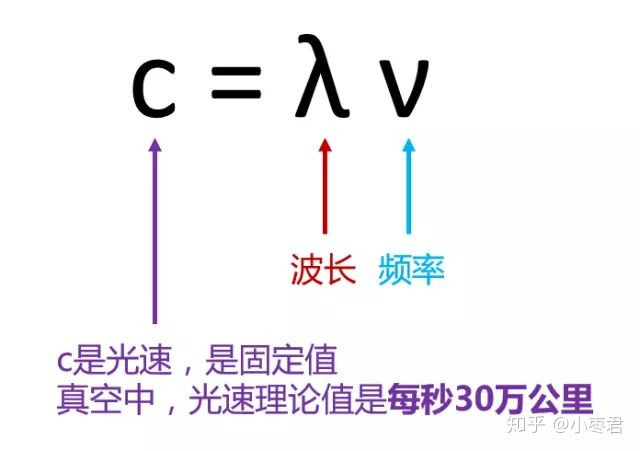

对于这个公式，可以这么说：无论是1G、2G、3G，还是4G、5G，万变不离其宗，全部都是在它身上做文章，没有跳出它的“五指山”。

且听我慢慢道来。。。

## 有线？无线？

通信技术，无论什么黑科技白科技，归根到底，就分为两种——有线通信和无线通信。

我和你打电话，信息数据要么在空中传播（看不见、摸不着），要么在实物上传播（看得见、摸得着）。

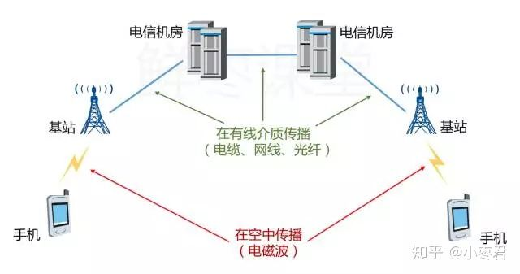

如果是在实体物质上传播，就是有线通信，基本上就是用的铜线、光纤这些线缆，统称为有线介质。

在有线介质上传播数据，速率可以达到很高的数值。

以光纤为例，在实验室中，单条光纤最大速度已达到了26Tbps。。。是传统网线的两万六千倍。。。

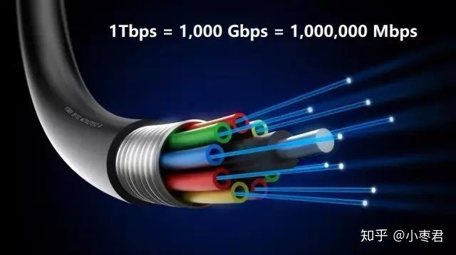

而空中传播这部分，才是移动通信的瓶颈所在。

目前主流的移动通信标准，是4G LTE，理论速率只有150Mbps（不包括载波聚合）。这个和有线是完全没办法相比的。

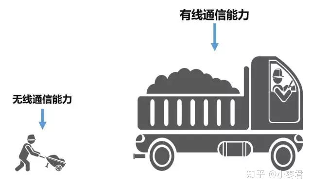

所以，**5G如果要实现端到端的高速率，重点是突破无线这部分的瓶颈**。

## 好大一个波

大家都知道，无线通信就是利用电磁波进行通信。电波和光波，都属于电磁波。

电磁波的功能特性，是由它的频率决定的。不同频率的电磁波，有不同的属性特点，从而有不同的用途。

例如，高频的γ射线，具有很大的杀伤力，可以用来治疗肿瘤。

我们目前主要使用电波进行通信。当然，光波通信也在崛起，例如LiFi。

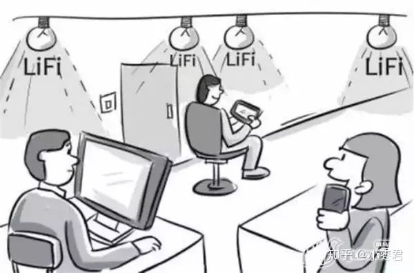

不偏题，回到电波先。

电波属于电磁波的一种，它的频率资源是有限的。

为了避免干扰和冲突，我们在电波这条公路上进一步划分车道，分配给不同的对象和用途。

请大家注意上面图中的红色字体。一直以来，我们主要是用中频~超高频进行手机通信的。

例如经常说的“GSM900”、“CDMA800”，其实意思就是指，工作频段在900MHz的GSM，和工作频段在800MHz的CDMA。

目前全球主流的4G LTE技术标准，属于特高频和超高频。

我们国家主要使用超高频：

大家能看出来，随着1G、2G、3G、4G的发展，使用的电波频率是越来越高的。

这是为什么呢？

这主要是因为，频率越高，能使用的频率资源越丰富。频率资源越丰富，能实现的传输速率就越高。

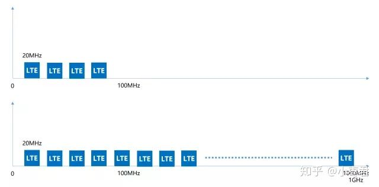

应该不难理解吧？频率资源就像车厢，越高的频率，车厢越多，相同时间内能装载的信息就越多。

那么，5G使用的频率具体是多少呢？

如下图所示：

5G的频率范围，分为两种：一种是6GHz以下，这个和目前我们的2/3/4G差别不算太大。还有一种，就很高了，在24GHz以上。

目前，国际上主要使用28GHz进行试验（这个频段也有可能成为5G最先商用的频段）。

如果按28GHz来算，根据前文我们提到的公式：

好啦，这个就是5G的第一个技术特点——

## 毫 米 波

请允许我再发一遍刚才那个频率对照表：

请注意看最下面一行，是不是就是“毫米波”？

继续，继续！

好了，既然，频率高这么好，你一定会问：“为什么以前我们不用高频率呢？”

原因很简单——不是不想用，是用不起。

**电磁波的显著特点：频率越高，波长越短，越趋近于直线传播（绕射能力越差）。频率越高，在传播介质中的衰减也越大。**

你看激光笔（波长635nm左右），射出的光是直的吧，挡住了就过不去了。

再看卫星通信和GPS导航（波长1cm左右），如果有遮挡物，就没信号了吧。

卫星那口大锅，必须校准瞄着卫星的方向，否则哪怕稍微歪一点，都会影响信号质量。

移动通信如果用了高频段，那么它最大的问题，就是传输距离大幅缩短，覆盖能力大幅减弱。

覆盖同一个区域，需要的5G基站数量，将大大超过4G。

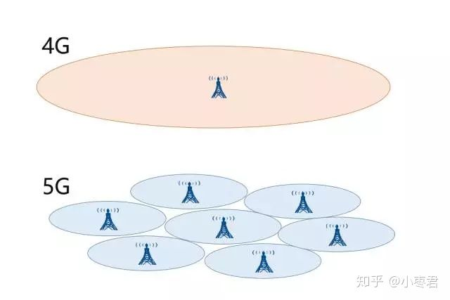

基站数量意味着什么？钱啊！投资啊！成本啊！

频率越低，网络建设就越省钱，竞争起来就越有利。这就是为什么，这些年，电信、移动、联通为了低频段而争得头破血流。

有的频段甚至被称为——**黄金频段**。

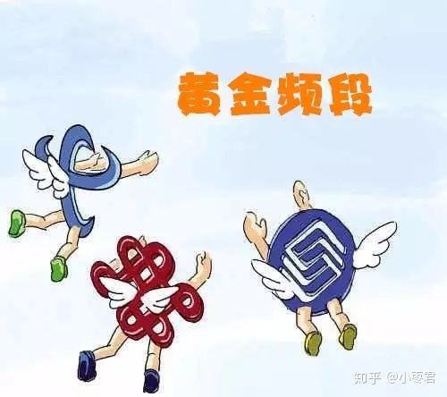

这也是为什么，5G时代，运营商拼命怼设备商，希望基站降价。（如果真的上5G，按以往的模式，设备商就发大财了。）

所以，基于以上原因，在高频率的前提下，为了减轻网络建设方面的成本压力，5G必须寻找新的出路。

出路有哪些呢？

首先，就是微基站。

## 微 基 站

基站有两种，微基站和宏基站。看名字就知道，微基站很小，宏基站很大！

宏基站：

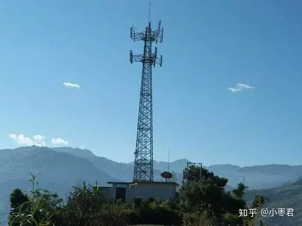

室外常见，建一个覆盖一大片

微基站：

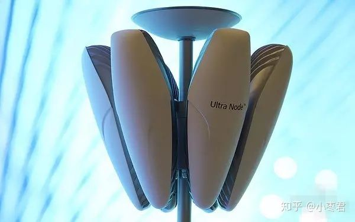

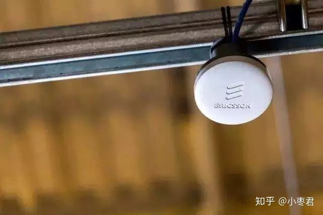

其实，微基站现在就有不少，尤其是城区和室内，经常能看到。

以后，到了5G时代，微基站会更多，到处都会装上，几乎随处可见。

你肯定会问，那么多基站在身边，会不会对人体造成影响？

我的回答是——不会。

其实，和传统认知恰好相反，事实上，基站数量越多，辐射反而越小！

你想一下，冬天，一群人的房子里，一个大功率取暖器好，还是几个小功率取暖器好？

大功率方案▼

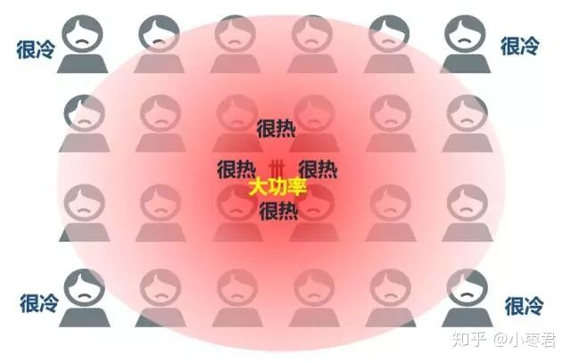

小功率方案▼

上面的图，一目了然了。基站小，功率低，对大家都好。如果只采用一个大基站，离得近，辐射大，离得远，没信号，反而不好。

　天线去哪了？　

大家有没有发现，以前大哥大都有很长的天线，早期的手机也有突出来的小天线，为什么现在我们的手机都没有天线了？

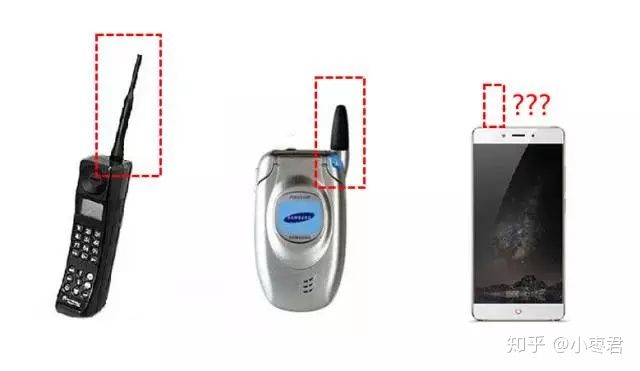

其实，我们并不是不需要天线，而是我们的天线变小了。

**根据天线特性，天线长度应与波长成正比，大约在1/10~1/4之间。**

随着时间变化，我们手机的通信频率越来越高，波长越来越短，天线也就跟着变短啦！ 

毫米波通信，天线也变成毫米级。。。

这就意味着，天线完全可以塞进手机的里面，甚至可以塞很多根。。。

这就是5G的第三大杀手锏—— 

**Ｍassive MIMO（多天线技术）**

MIMO就是“多进多出”（Multiple-Input Multiple-Output），多根天线发送，多根天线接收。

在LTE时代，我们就已经有MIMO了，但是天线数量并不算多，只能说是初级版的MIMO。

到了5G时代，继续把MIMO技术发扬光大，现在变成了加强版的Massive　MIMO（Massive：大规模的，大量的）。

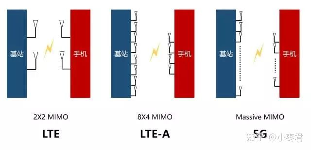

手机里面都能塞好多根天线，基站就更不用说了。

以前的基站，天线就那么几根：

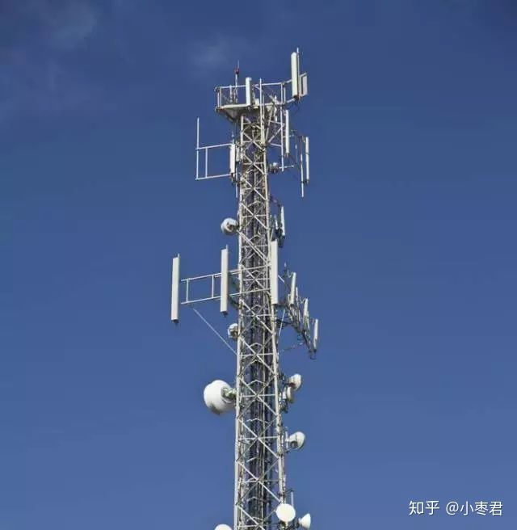

5G时代，天线数量不是按根来算了，是按“阵”。。。“天线阵列”。。。一眼看去，要得密集恐惧症的节奏。。。

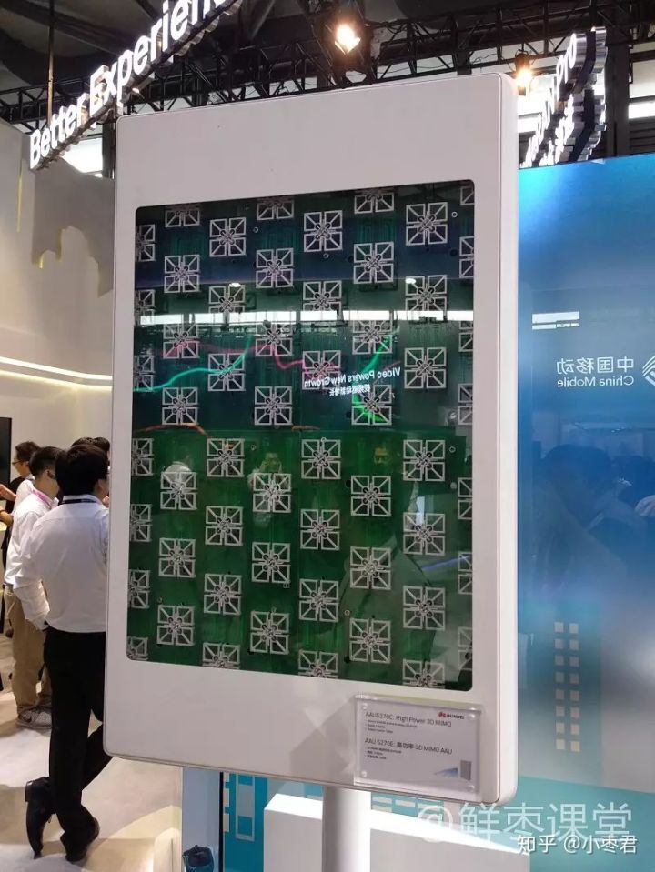

不过，天线之间的距离也不能太近。

因为天线特性要求，多天线阵列要求天线之间的距离保持在半个波长以上。如果距离近了，就会互相干扰，影响信号的收发。

## 你是直的？还是弯的？

大家都见过灯泡发光吧？　

其实，基站发射信号的时候，就有点像灯泡发光。

信号是向四周发射的，对于光，当然是照亮整个房间，如果只是想照亮某个区域或物体，那么，大部分的光都浪费了。。。

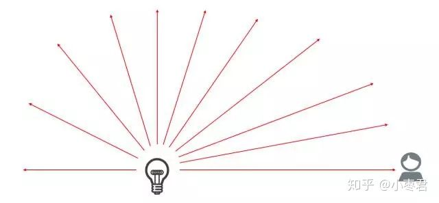

基站也是一样，大量的能量和资源都浪费了。

我们能不能找到一只无形的手，把散开的光束缚起来呢？

这样既节约了能量，也保证了要照亮的区域有足够的光。

答案是：可以。

这就是——

波 束 赋 形

## 波束赋形

在基站上布设天线阵列，通过对射频信号相位的控制，使得相互作用后的电磁波的波瓣变得非常狭窄，并指向它所提供服务的手机，而且能跟据手机的移动而转变方向。

这种空间复用技术，由全向的信号覆盖变为了精准指向性服务，波束之间不会干扰，在相同的空间中提供更多的通信链路，极大地提高基站的服务容量。

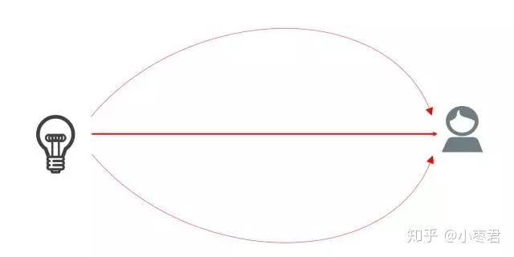

直的都能掰成弯的。。。还有什么是通信砖家干不出来的？

## 别收我钱，行不行？

在目前的移动通信网络中，即使是两个人面对面拨打对方的手机（或手机对传照片），信号都是通过基站进行中转的，包括控制信令和数据包。。。　

而在5G时代，这种情况就不一定了。

5G的第五大特点——D2D，也就是Device to Device（设备到设备）。

Ｄ２Ｄ

5G时代，同一基站下的两个用户，如果互相进行通信，他们的数据将不再通过基站转发，而是直接手机到手机。。。

这样，就节约了大量的空中资源，也减轻了基站的压力。

END

>原作者：小枣君
